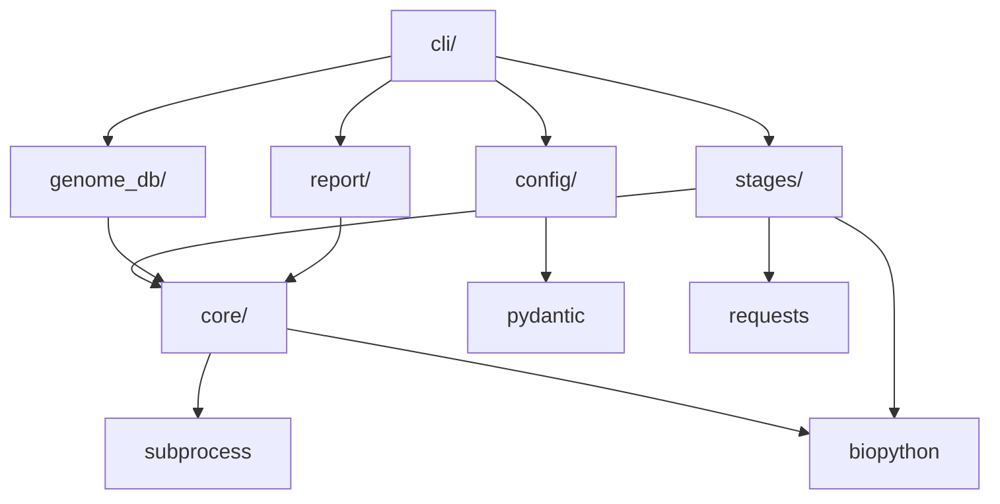
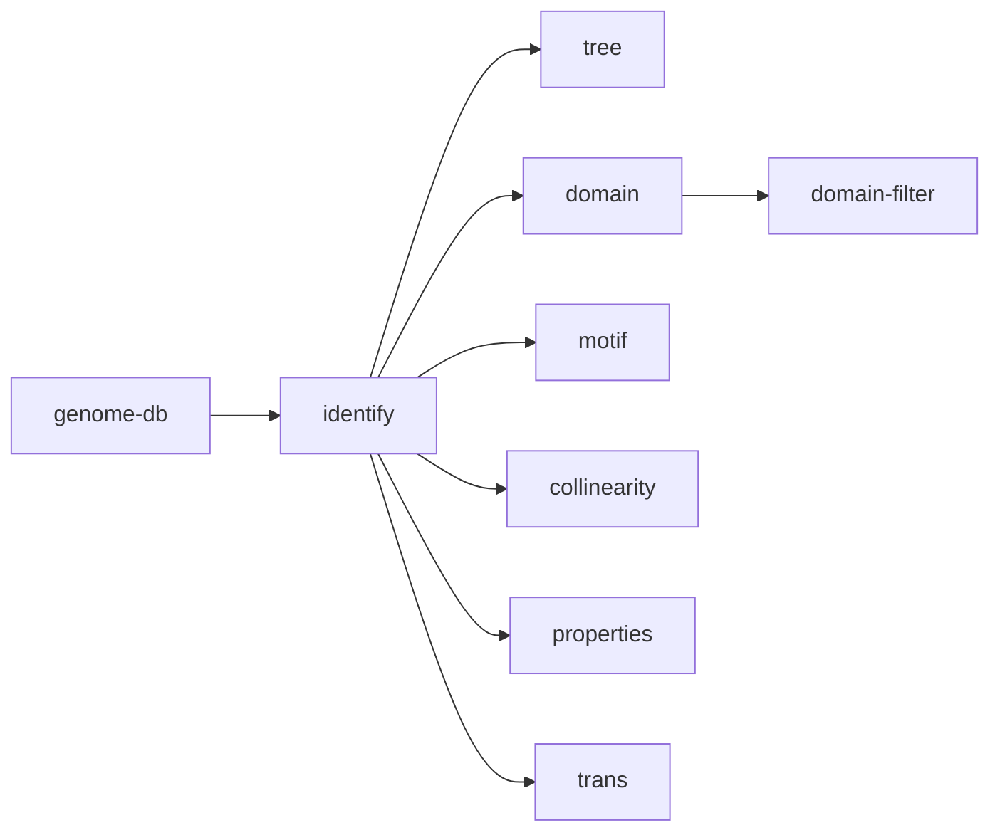

# 设计文档：gene-family-pipeline

## 概述

`gene-family-pipeline` 是一个将现有 Jupyter Notebook 基因家族分析工作流重构为结构化 Python CLI 应用的项目。

该应用以 `gfpipeline` 命令行入口提供服务，支持按阶段独立运行或一键执行全流程，通过 YAML 配置文件驱动项目参数，结果统一输出到 `results/{Proj_Name}_results/` 目录。

### 设计目标

- 将 Notebook 中的 shell 命令和 Python 代码封装为可复用、可测试的模块
- 通过配置文件驱动，无需修改代码即可切换项目
- 支持断点续跑（跳过已存在的中间文件）
- 提供清晰的错误信息和日志记录
- 各阶段松耦合，可独立调用

### 技术选型

- CLI 框架：`click`（支持子命令嵌套、参数验证、帮助文档自动生成）
- 配置解析：`pyyaml` + `pydantic`（Schema 验证 + 类型安全）
- 外部工具调用：`subprocess`（统一封装，支持 dry-run 和日志）
- 序列处理：`biopython`（SeqIO、ProteinAnalysis）
- HTTP 请求：`requests`（NCBI Batch CD-Search API）
- 可视化：`matplotlib` / `seaborn`（热图、Venn 图）
- 属性测试：`hypothesis`（property-based testing）

---

## 架构

### 整体模块划分

```
gfpipeline/
├── cli/                  # CLI 入口层（click 命令定义）
│   ├── main.py           # 顶层 gfpipeline 命令
│   ├── cmd_run.py        # run 子命令
│   ├── cmd_genome_db.py  # genome-db 子命令组
│   └── cmd_stages.py     # identify/tree/domain/... 各阶段子命令
├── config/               # 配置解析层
│   ├── schema.py         # Pydantic 配置 Schema
│   └── loader.py         # YAML 加载与验证
├── stages/               # 各分析阶段实现
│   ├── identify.py       # 基因家族鉴定
│   ├── tree.py           # 系统发育树构建
│   ├── domain.py         # 保守结构域分析
│   ├── domain_filter.py  # 结构域筛选
│   ├── motif.py          # Motif 发现与筛选
│   ├── collinearity.py   # 共线性分析
│   ├── properties.py     # 理化性质分析
│   └── trans.py          # 转录组分析
├── genome_db/            # 基因组数据库准备
│   ├── blast_db.py       # BLAST 数据库构建
│   ├── gff_qc.py         # GFF3 质检与修正
│   ├── gene_index.py     # 基因序列索引
│   └── rep_index.py      # 代表转录本索引
├── core/                 # 核心工具层
│   ├── runner.py         # 外部工具调用封装（subprocess wrapper）
│   ├── file_manager.py   # 目录/文件管理、命名规范
│   ├── logger.py         # 日志记录
│   ├── tool_checker.py   # 工具依赖检查
│   └── sequence.py       # 序列提取工具函数
└── report/
    └── summary.py        # 全流程汇总报告
```

### 模块依赖关系



### 阶段依赖关系



---

## 组件与接口

### CLI 命令树

```
gfpipeline
├── --config / -c       配置文件路径（默认 config.yaml）
├── --dry-run           打印命令但不执行
├── --verbose           详细日志
├── --force             强制重新生成中间文件
│
├── run                 执行全流程（identify→tree→domain→domain-filter→motif→collinearity）
│
├── genome-db           基因组数据库准备
│   ├── blast           构建 BLAST 数据库
│   ├── gff-qc          GFF3 质检与修正
│   ├── gene-index      基因序列索引
│   ├── rep-index       代表转录本索引
│   └── query           序列快速查询
│       ├── --id        基因/转录本 ID
│       ├── --type      cds|pep|genome
│       └── --output    输出文件（默认 stdout）
│
├── identify            基因家族鉴定
├── tree                系统发育树构建
├── domain              保守结构域分析
├── domain-filter       结构域筛选
├── motif               Motif 发现与筛选
├── collinearity        共线性分析
├── properties          理化性质分析
└── trans               转录组分析
```

### core/runner.py — 外部工具调用封装

```python
class ToolRunner:
    def __init__(self, dry_run: bool = False, verbose: bool = False):
        self.dry_run = dry_run
        self.verbose = verbose

    def run(self, cmd: list[str], cwd: str | None = None) -> subprocess.CompletedProcess:
        """执行外部命令，支持 dry-run 和详细日志。失败时抛出 PipelineError。"""

    def run_shell(self, cmd: str, cwd: str | None = None) -> subprocess.CompletedProcess:
        """执行 shell 字符串命令（用于管道等复杂场景）。"""
```

### core/tool_checker.py — 工具依赖检查

```python
STAGE_TOOLS: dict[str, list[str]] = {
    "identify":    ["muscle", "hmmbuild", "hmmsearch", "hmmemit", "blastp"],
    "tree":        ["muscle", "trimal", "iqtree2"],
    "domain":      [],
    "motif":       ["meme", "fimo"],
    "collinearity":["blastp"],   # mcscanx 或 jcvi 按配置动态添加
    "genome-db blast":   ["makeblastdb"],
    "genome-db gff-qc":  ["samtools"],
    "genome-db gene-index": ["samtools"],
    "genome-db rep-index":  [],
}

def check_tools(stage: str, config: PipelineConfig) -> None:
    """检查指定阶段所需工具是否可执行，不可用时抛出 ToolNotFoundError。"""

def is_executable(tool_path: str) -> bool:
    """检查工具是否在 PATH 或指定路径中可执行。"""
```

### core/file_manager.py — 文件管理

```python
class FileManager:
    def __init__(self, config: PipelineConfig):
        self.proj = config.project_name
        self.data_dir = Path(config.data_dir)
        self.result_dir = Path(config.result_dir)

    def result(self, stage: str, type_: str, ext: str) -> Path:
        """返回 result_dir/{Proj_Name}.{stage}.{type}.{ext} 路径。"""

    def data(self, name: str) -> Path:
        """返回 data_dir/{name} 路径。"""

    def ensure_dirs(self) -> None:
        """创建 data_dir 和 result_dir（exist_ok=True）。"""

    def skip_if_exists(self, path: Path, force: bool) -> bool:
        """若文件存在且 force=False 则返回 True（跳过），否则返回 False。"""
```

### core/sequence.py — 序列提取

```python
def extract_fasta(db_path: Path, id_list: list[str], output_path: Path) -> int:
    """从 FASTA 文件中按 ID 列表提取序列，返回提取数量。使用 BioPython SeqIO.index。"""

def transcript_to_gene_id(transcript_id: str) -> str:
    """将转录本 ID 转换为基因 ID（如 Os01t0936800-01 → Os01g0936800）。"""

def parse_hmm_idlist(hmm_out: Path, evalue_threshold: float) -> list[str]:
    """解析 hmmsearch 输出，提取 e-value 低于阈值的序列 ID。"""

def parse_blast_idlist(blast_out: Path) -> list[str]:
    """解析 blastp tabular 输出（outfmt 6），提取第二列（subject ID）并去重。"""
```

---

## 数据模型

### 配置 Schema（Pydantic）

```python
class ToolsConfig(BaseModel):
    muscle:     str = "muscle"
    hmmbuild:   str = "hmmbuild"
    hmmsearch:  str = "hmmsearch"
    hmmemit:    str = "hmmemit"
    blastp:     str = "blastp"
    trimal:     str = "trimal"
    iqtree:     str = "iqtree2"
    meme:       str = "meme"
    fimo:       str = "fimo"
    mcscanx:    str = "MCScanX"
    makeblastdb:str = "makeblastdb"
    samtools:   str = "samtools"
    minimap2:   str = "minimap2"
    stringtie:  str = "stringtie"

class DatabasesConfig(BaseModel):
    pep:      str          # 全基因组蛋白 FASTA
    cds:      str          # 全基因组 CDS FASTA
    genome:   str          # 基因组序列 FASTA
    blast_db: str          # BLAST 数据库前缀
    gff3:     str          # GFF3 注释文件

class IdentifyConfig(BaseModel):
    hmm_evalue:    float = 100
    blast_evalue:  float = 1e-5
    blast_threads: int   = 10

class TreeConfig(BaseModel):
    iqtree_bootstrap: int = 1000

class DomainConfig(BaseModel):
    evalue:         float        = 0.01
    maxhit:         int          = 250
    genome_cdd:     str | None   = None
    target_domains: list[str]    = []

class MotifConfig(BaseModel):
    num_motifs:     int   = 10
    min_width:      int   = 6
    max_width:      int   = 50
    filter_mode:    str   = "any"   # any | all | min_count
    min_motif_count:int   = 1

class CollinearityConfig(BaseModel):
    tool:          str = "jcvi"   # jcvi | mcscanx
    blast_threads: int = 10

class GffQcConfig(BaseModel):
    output_dir:    str        = "data/gff_qc/"
    min_cds_len:   int        = 150
    edge_distance: int        = 500
    rna_bam:       list[str]  = []
    transcript_fa: str | None = None
    extra_gff:     list[str]  = []

class GenomeDbConfig(BaseModel):
    build_prot:    bool       = True
    build_nucl:    bool       = True
    index_dir:     str        = "data/genome_index/"
    rep_index_dir: str        = "data/rep_index/"
    genome_name:   str | None = None   # 默认使用 project_name
    rep_selection: str        = "longest_cds"  # longest_cds | longest_mrna

class TransConfig(BaseModel):
    expression_matrix: str | None = None
    logfc_threshold:   float | None = None
    pvalue_threshold:  float | None = None
    venn_groups:       list[str]    = []

class PipelineConfig(BaseModel):
    project_name: str
    data_dir:     str
    result_dir:   str
    databases:    DatabasesConfig
    tools:        ToolsConfig        = ToolsConfig()
    identify:     IdentifyConfig     = IdentifyConfig()
    tree:         TreeConfig         = TreeConfig()
    domain:       DomainConfig       = DomainConfig()
    motif:        MotifConfig        = MotifConfig()
    collinearity: CollinearityConfig = CollinearityConfig()
    gff_qc:       GffQcConfig        = GffQcConfig()
    genome_db:    GenomeDbConfig     = GenomeDbConfig()
    trans:        TransConfig        = TransConfig()
```

### YAML 配置文件示例

```yaml
project_name: OSACO
data_dir: data/OSACO_data/
result_dir: results/OSACO_results/

databases:
  pep:      data/Oryza_sativa.IRGSP-1.0.pep.all.simp.rep.fa
  cds:      data/Oryza_sativa.IRGSP-1.0.cds.all.simp.rep.fa
  genome:   data/Oryza_sativa.IRGSP-1.0.dna_sm.toplevel.fa
  blast_db: data/Oryza_sativa.IRGSP-1.0.pep.all.simp.rep
  gff3:     data/Oryza_sativa.IRGSP-1.0.58.chr.gff3

tools:
  muscle:  muscle
  iqtree:  iqtree2

identify:
  hmm_evalue:    100
  blast_evalue:  1e-5
  blast_threads: 10

tree:
  iqtree_bootstrap: 1000

domain:
  evalue:  0.01
  maxhit:  250

motif:
  num_motifs:  10
  filter_mode: any

collinearity:
  tool:          jcvi
  blast_threads: 10

genome_db:
  build_prot:    true
  build_nucl:    true
  rep_selection: longest_cds

gff_qc:
  min_cds_len:   150
  edge_distance: 500
```

### 关键数据结构

```python
# 基因到转录本映射
@dataclass
class GeneTranscriptMap:
    gene_id:       str
    transcript_ids: list[str]
    rep_transcript: str        # 代表转录本 ID
    cds_lengths:   dict[str, int]  # transcript_id -> CDS 长度

# GFF3 质检结果
@dataclass
class GffQcRecord:
    gene_id:     str
    issue_type:  str   # format_error | missing_start | missing_stop | short_cds | edge_truncated
    detail:      str
    is_truncated:bool

# 结构域筛选汇总行
@dataclass
class DomainSummaryRow:
    gene_id:              str
    domain_accession:     str
    domain_name:          str
    superfamily_accession:str
    evalue:               float

# Motif 命中汇总行
@dataclass
class MotifHitRow:
    gene_id:       str
    motif_id:      str
    motif_name:    str
    sequence_name: str
    start:         int
    stop:          int
    score:         float
    p_value:       float

# 共线性块行
@dataclass
class CollinearityBlock:
    block_id:    str
    gene1:       str
    gene2:       str
    chromosome1: str
    chromosome2: str
    score:       float
```

---

## 各阶段详细设计

### 阶段 0：genome-db

#### genome-db blast（BLAST_DB_Builder）

```python
class BlastDbBuilder:
    def __init__(self, config: PipelineConfig, runner: ToolRunner, fm: FileManager): ...

    def run(self, force: bool = False) -> None:
        """
        1. 检查输入文件存在性
        2. 若 build_prot=True：makeblastdb -in {pep} -dbtype prot -out {blast_db}
        3. 若 build_nucl=True：makeblastdb -in {genome} -dbtype nucl -out {genome}.db
        4. 输出统计信息
        """
```

#### genome-db gff-qc（GFF_QC）

```python
class GffQc:
    def __init__(self, config: PipelineConfig, runner: ToolRunner): ...

    def parse_gff3(self, gff3_path: Path) -> dict[str, GeneModel]:
        """解析 GFF3，构建 gene_id -> GeneModel 映射。"""

    def check_format(self, gene_models: dict) -> list[GffQcRecord]:
        """检查 ID/Parent 完整性、坐标合法性、strand 一致性。"""

    def check_completeness(self, gene_models: dict) -> list[GffQcRecord]:
        """检查 start/stop codon、CDS 完整性。"""

    def mark_truncated(self, gene_models: dict, records: list[GffQcRecord],
                       chrom_sizes: dict[str, int]) -> list[str]:
        """标记 Truncated_Gene，返回 truncated gene_id 列表。"""

    def fix_truncated(self, truncated_ids: list[str], gene_models: dict) -> dict:
        """
        按配置使用 StringTie/minimap2/extra_gff 修正 Truncated_Gene。
        仅修正 Truncated_Gene，其余基因保持原始注释不变。
        """

    def run(self, force: bool = False) -> None:
        """执行完整 gff-qc 流程，输出 report.tsv / summary.txt / fixed.gff3 / fix.log。"""
```

**关键算法：Truncated_Gene 判定**

满足以下任一条件即标记为 Truncated_Gene：
1. 基因起始或终止坐标距所在 scaffold/contig 末端 ≤ `gff_qc.edge_distance` bp
2. 所有 CDS 特征的总长度 < `gff_qc.min_cds_len`
3. 缺少 `start_codon` 或 `stop_codon` 注释记录

#### genome-db gene-index（Gene_Index_Builder）

```python
class GeneIndexBuilder:
    def __init__(self, config: PipelineConfig, runner: ToolRunner, fm: FileManager): ...

    def build_fasta_index(self, fasta_path: Path) -> None:
        """调用 samtools faidx 建立 .fai 索引；若 samtools 不可用则用 BioPython SeqIO.index。"""

    def build_gene2transcript(self, gff3_path: Path) -> dict[str, list[str]]:
        """解析 GFF3，构建 gene_id -> [transcript_id, ...] 映射，输出 gene2transcript.tsv。"""

    def build_transcript2location(self, gff3_path: Path) -> None:
        """构建 transcript_id -> 坐标信息映射，输出 transcript2location.tsv。"""

    def query(self, id_: str, seq_type: str) -> str:
        """利用索引快速提取序列，返回 FASTA 字符串。"""

    def run(self, force: bool = False) -> None: ...
```

#### genome-db rep-index（Rep_Index_Builder）

```python
class RepIndexBuilder:
    def __init__(self, config: PipelineConfig, fm: FileManager): ...

    def select_representative(self, gene_id: str,
                               transcripts: list[str],
                               cds_lengths: dict[str, int]) -> str:
        """
        longest_cds 策略：选 CDS 最长的转录本；等长时取字典序最小。
        longest_mrna 策略：选 mRNA 总长最长的转录本；等长时取字典序最小。
        """

    def run(self, force: bool = False) -> None:
        """
        1. 解析 GFF3，获取每个基因的转录本列表和 CDS 长度
        2. 对每个基因调用 select_representative
        3. 提取代表转录本 CDS 序列 → rep.cds.fa
        4. 翻译为蛋白序列 → rep.pep.fa
        5. 输出 rep.idlist 和 gene2rep.tsv
        """
```

**关键算法：代表转录本选取**

```python
def select_representative(gene_id, transcripts, cds_lengths):
    if not transcripts:
        log.warning(f"{gene_id}: 无转录本，跳过")
        return None
    valid = {t: cds_lengths.get(t, 0) for t in transcripts if cds_lengths.get(t, 0) > 0}
    if not valid:
        log.warning(f"{gene_id}: 所有转录本均无 CDS，跳过")
        return None
    max_len = max(valid.values())
    candidates = sorted(t for t, l in valid.items() if l == max_len)
    return candidates[0]  # 字典序最小
```

### 阶段 1：identify

```python
class IdentifyStage:
    def __init__(self, config: PipelineConfig, runner: ToolRunner, fm: FileManager): ...

    def build_hmm(self) -> None:
        """muscle 多序列比对 → hmmbuild 构建 HMM profile。"""

    def hmm_search(self) -> list[str]:
        """hmmsearch → 解析结果 → 返回候选 ID 列表。"""

    def blast_search(self) -> list[str]:
        """hmmemit → blastp → 解析 tabular 输出 → 返回候选 ID 列表。"""

    def merge_ids(self, hmm_ids: list[str], blast_ids: list[str]) -> list[str]:
        """合并、排序、去重两个 ID 列表。"""

    def extract_sequences(self, ids: list[str], gene_ids: list[str]) -> None:
        """提取 CDS、蛋白、基因组序列。"""

    def run(self, force: bool = False) -> None: ...
```

**数据流：**

```
ref.fa → muscle → ref.afa → hmmbuild → {Proj}.hmm
                                          ↓
                                    hmmsearch → hmm.out → hmm.idlist
                                          ↓
                                    hmmemit → hmmemit.out → blastp → blast.out → blast.idlist
                                                                          ↓
                                    merge(hmm.idlist, blast.idlist) → candidates.idlist
                                                                          ↓
                                    transcript→gene → candidates.gene.idlist
                                                                          ↓
                                    extract_fasta(cds/pep/genome) → candidates.{cds,pep,genome}.fa
```

### 阶段 2：tree

```python
class TreeStage:
    def __init__(self, config: PipelineConfig, runner: ToolRunner, fm: FileManager): ...

    def run(self, force: bool = False) -> None:
        """
        1. 检查 candidates.pep.fa 存在
        2. muscle 多序列比对 → tree.pep.afa
        3. trimal -automated1 → tree.pep.trimed.afa
        4. iqtree2 -bb {bootstrap} -bnni -nt AUTO → 树文件
        """
```

### 阶段 3：domain

```python
class DomainStage:
    def __init__(self, config: PipelineConfig, fm: FileManager): ...

    def submit_batch(self, fasta_path: Path) -> str:
        """向 NCBI Batch CD-Search API 提交序列，返回 RID。"""

    def poll_status(self, rid: str) -> None:
        """每 5 秒轮询，直到状态码为 0；错误状态码抛出异常。"""

    def download_result(self, rid: str, output: Path) -> None:
        """下载结果并保存。"""

    def run(self, force: bool = False) -> None: ...
```

### 阶段 3b：domain-filter

```python
class DomainFilterStage:
    def __init__(self, config: PipelineConfig, fm: FileManager): ...

    def extract_target_domains(self, cdd_result: Path) -> tuple[set[str], set[str]]:
        """从候选基因 CDD 结果中提取 Domain_Accession 和 Superfamily_Accession 集合。"""

    def parse_cdd_result(self, cdd_path: Path) -> list[DomainSummaryRow]:
        """解析 CDD 结果文件（TSV 格式），返回结构域记录列表。"""

    def filter_by_domains(self, rows: list[DomainSummaryRow],
                          target_domains: set[str],
                          target_superfamilies: set[str]) -> list[str]:
        """筛选含目标结构域或超家族的基因 ID。"""

    def submit_genome_batch(self, pep_db: Path) -> Path:
        """分批（每批 ≤4000 条）提交全基因组蛋白到 NCBI CD-Search，合并结果。"""

    def run(self, force: bool = False) -> None: ...
```

**关键算法：结构域筛选逻辑**

```python
def filter_by_domains(rows, target_domains, target_superfamilies):
    result = set()
    for row in rows:
        if row.domain_accession in target_domains:
            result.add(row.gene_id)
        elif row.superfamily_accession in target_superfamilies:
            result.add(row.gene_id)
    return sorted(result)
```

### 阶段 4：motif

```python
class MotifStage:
    def __init__(self, config: PipelineConfig, runner: ToolRunner, fm: FileManager): ...

    def run_meme(self) -> Path:
        """调用 meme，输出到 {Proj}.motif.meme/ 目录，返回 meme.xml 路径。"""

    def run_fimo(self, meme_dir: Path) -> Path:
        """调用 fimo 扫描全基因组蛋白，输出到 {Proj}.motif.fimo/ 目录。"""

    def parse_fimo(self, fimo_dir: Path) -> dict[str, list[str]]:
        """解析 fimo.tsv，返回 gene_id -> [motif_id, ...] 映射。"""

    def filter_genes(self, gene_motifs: dict[str, list[str]],
                     all_motif_ids: list[str]) -> list[str]:
        """
        按 filter_mode 筛选：
        - any:       命中任意一个 motif
        - all:       命中全部 motif
        - min_count: 命中数量 >= min_motif_count
        """

    def run(self, force: bool = False) -> None: ...
```

### 阶段 5：collinearity

```python
class CollinearityStage:
    def __init__(self, config: PipelineConfig, runner: ToolRunner, fm: FileManager): ...

    def run_all_vs_all_blast(self) -> Path:
        """全基因组蛋白 blastp 自比对，输出 collinearity.blast.out。"""

    def run_jcvi(self) -> None:
        """调用 python -m jcvi.compara.catalog ortholog，输出到 collinearity/ 目录。"""

    def run_mcscanx(self) -> None:
        """调用 MCScanX，输出到 collinearity/ 目录。"""

    def extract_target_blocks(self, gene_ids: list[str]) -> list[CollinearityBlock]:
        """从共线性结果中提取包含目标基因的共线性块。"""

    def parse_gene_locations(self, gff3: Path, gene_ids: list[str]) -> None:
        """解析 GFF3，生成基因位置信息表 collinearity.gene-location.tsv。"""

    def run(self, force: bool = False) -> None: ...
```

### 阶段 6：properties

```python
class PropertiesStage:
    def __init__(self, config: PipelineConfig, fm: FileManager): ...

    def calc_properties(self, pep_fa: Path) -> list[dict]:
        """
        使用 BioPython ProteinAnalysis 计算：
        - 分子量（molecular_weight）
        - 等电点（isoelectric_point）
        - 氨基酸组成（amino_acids_percent）
        """

    def run(self, force: bool = False) -> None:
        """计算理化性质 → properties.tsv，并输出在线工具提示。"""
```

### 阶段 7：trans

```python
class TransStage:
    def __init__(self, config: PipelineConfig, fm: FileManager): ...

    def load_expression_matrix(self, path: Path) -> pd.DataFrame:
        """加载表达量矩阵（行为基因，列为样本）。"""

    def filter_family_members(self, matrix: pd.DataFrame,
                               gene_ids: list[str]) -> pd.DataFrame:
        """筛选属于当前基因家族的行。"""

    def plot_heatmap(self, matrix: pd.DataFrame, output: Path) -> None:
        """使用 seaborn clustermap 绘制表达量热图。"""

    def filter_deg(self, matrix: pd.DataFrame) -> pd.DataFrame:
        """按 logfc_threshold 和 pvalue_threshold 筛选差异表达基因。"""

    def plot_venn(self, groups: list[str], matrix: pd.DataFrame, output: Path) -> None:
        """绘制 Venn 图（使用 matplotlib_venn）。"""

    def run(self, force: bool = False) -> None: ...
```

---

## 错误处理策略

### 异常层次

```python
class PipelineError(Exception):
    """所有 pipeline 错误的基类，携带阶段名称和原因。"""

class ConfigError(PipelineError):
    """配置文件缺失字段或格式错误。"""

class ToolNotFoundError(PipelineError):
    """所需外部工具不可执行。"""

class StageInputError(PipelineError):
    """阶段所需输入文件不存在。"""

class ExternalToolError(PipelineError):
    """外部工具执行失败（非零返回码）。"""

class ApiError(PipelineError):
    """NCBI API 请求失败。"""
```

### 错误处理原则

1. 所有外部工具调用通过 `ToolRunner.run()` 统一封装，非零返回码抛出 `ExternalToolError`，包含工具名、命令、stderr 内容
2. 配置加载时 Pydantic 验证失败，捕获 `ValidationError` 转换为 `ConfigError`，输出缺失字段名
3. 阶段启动时检查输入文件，不存在则抛出 `StageInputError`，提示用户先运行前置阶段
4. NCBI API 调用失败（非 200 状态码或错误状态码）抛出 `ApiError`，包含 HTTP 状态码和原因
5. CLI 顶层捕获所有 `PipelineError`，输出格式化错误信息后以非零状态码退出
6. 非预期异常（如 IOError）在 CLI 顶层捕获，输出 traceback（`--verbose` 模式）或简短提示

### 日志策略

- 使用 Python 标准库 `logging`，日志同时写入 `Result_Dir/pipeline.log` 和 stderr
- 每次运行追加日志，包含时间戳、阶段名、步骤状态（SUCCESS/SKIP/FAILED）、耗时
- `--verbose` 模式下输出 DEBUG 级别日志（包含完整命令行）
- 默认 INFO 级别（阶段开始/结束、跳过提示、关键统计数字）

---

## 测试策略

### 双轨测试方法

采用单元测试（pytest）和属性测试（hypothesis）相结合的方式：

- 单元测试：验证具体示例、边界条件、错误处理路径
- 属性测试：验证对所有有效输入均成立的普遍性质

### 单元测试覆盖重点

- `config/loader.py`：有效配置解析、缺失必填字段报错、默认值填充
- `core/sequence.py`：ID 转换、FASTA 提取、HMM/BLAST 结果解析
- `genome_db/rep_index.py`：代表转录本选取逻辑（等长时字典序、无 CDS 时跳过）
- `genome_db/gff_qc.py`：Truncated_Gene 判定、未修改基因保持不变
- `stages/domain_filter.py`：结构域筛选逻辑（精确匹配 + 超家族匹配）
- `stages/motif.py`：三种 filter_mode 的筛选逻辑
- `report/summary.py`：文件存在性检查、未执行阶段标注

### 属性测试配置

使用 `hypothesis` 库，每个属性测试最少运行 100 次迭代：

```python
from hypothesis import given, settings
from hypothesis import strategies as st

@given(...)
@settings(max_examples=100)
def test_property_xxx(...):
    # Feature: gene-family-pipeline, Property N: <property_text>
    ...
```

---

## 正确性属性

*属性（Property）是在系统所有有效执行中都应成立的特征或行为——本质上是关于系统应做什么的形式化陈述。属性是人类可读规范与机器可验证正确性保证之间的桥梁。*

### 属性 1：配置往返解析

*对任意* 有效的 `PipelineConfig` 对象，将其序列化为 YAML 字符串后再解析，应得到与原始对象等价的配置对象。

**验证：需求 2.6**

---

### 属性 2：缺失必填字段时解析失败并报告字段名

*对任意* 缺少一个或多个必填字段（`project_name`、`data_dir`、`result_dir`、`databases.*`）的配置字典，解析时应抛出包含缺失字段名称的错误，且不产生部分初始化的配置对象。

**验证：需求 2.5**

---

### 属性 3：ID 列表合并为并集且无重复

*对任意* 两个转录本 ID 列表（HMM 结果列表和 BLAST 结果列表），合并后的结果应满足：(a) 包含两个列表中的所有 ID；(b) 不含重复元素；(c) 结果长度 ≤ 两列表长度之和。

**验证：需求 3.9**

---

### 属性 4：Transcript_ID 到 Gene_ID 转换的格式正确性

*对任意* 符合水稻转录本 ID 格式（如 `OsXXtYYYYYYY-NN`）的字符串，`transcript_to_gene_id` 函数的输出应满足：(a) 将标识符中的 `t` 替换为 `g`；(b) 去除 `-NN` 后缀；(c) 对同一基因的所有转录本，转换结果相同。

**验证：需求 3.10**

---

### 属性 5：Truncated_Gene 标记的充分条件

*对任意* 基因模型，若满足以下任一条件，则 `mark_truncated` 函数应将其标记为 Truncated_Gene：(a) 基因坐标距 scaffold/contig 末端 ≤ `edge_distance` bp；(b) CDS 总长度 < `min_cds_len`；(c) 缺少 `start_codon` 或 `stop_codon` 注释。

**验证：需求 15.4**

---

### 属性 6：未被标记为 Truncated_Gene 的基因在输出中保持不变

*对任意* GFF3 输入文件，经过 gff-qc 流程后，所有未被标记为 Truncated_Gene 的基因在 `gff_qc.fixed.gff3` 中的记录应与原始 GFF3 中的记录完全一致（逐行相同）。

**验证：需求 15.13**

---

### 属性 7：gene2transcript 映射的完整性

*对任意* GFF3 文件，`Gene_Index_Builder` 构建的 `gene2transcript.tsv` 中应包含 GFF3 中每一个 transcript 特征对应的记录，不遗漏任何转录本 ID。

**验证：需求 16.7**

---

### 属性 8：每个基因有且仅有一条代表转录本记录

*对任意* GFF3 文件（其中每个基因至少有一个含 CDS 的转录本），`Rep_Index_Builder` 生成的 `gene2rep.tsv` 中每个 `gene_id` 应恰好出现一次。

**验证：需求 17.8**

---

### 属性 9：代表转录本序列完整性

*对任意* GFF3 文件，`gene2rep.tsv` 中列出的所有 `rep_transcript_id` 在 `{Genome_Name}.rep.cds.fa` 中都应有对应的序列记录，不存在有映射但无序列的情况。

**验证：需求 17.9**

---

### 属性 10：结构域筛选结果的正确性

*对任意* CDD 结果记录集合和目标结构域/超家族 accession 集合，`filter_by_domains` 函数返回的基因 ID 列表中，每个基因都应至少有一条记录的 `domain_accession` 在目标集合中（精确匹配），或 `superfamily_accession` 在目标超家族集合中（超家族匹配）；且所有满足条件的基因都应被包含在结果中（无遗漏）。

**验证：需求 6.4**

---

### 属性 11：Motif 筛选模式的正确性

*对任意* 基因-motif 命中映射和筛选配置，`filter_genes` 函数的结果应满足：当 `filter_mode=any` 时，结果中每个基因至少命中一个 motif；当 `filter_mode=all` 时，结果中每个基因命中所有目标 motif；当 `filter_mode=min_count` 时，结果中每个基因命中的 motif 数量 ≥ `min_motif_count`；且所有满足条件的基因都被包含（无遗漏）。

**验证：需求 7.5、7.6、7.7**

---

### 属性 12：汇总报告中的文件路径均实际存在

*对任意* 成功执行完成的阶段，`Summary_Reporter` 在汇总报告中列出的该阶段输出文件路径，在文件系统中应均实际存在（`os.path.exists` 返回 True）。

**验证：需求 12.5**

---

## 外部工具调用接口设计

所有外部工具调用通过 `ToolRunner` 统一封装，格式如下：

| 工具 | 调用方式 | 关键参数 |
|------|----------|----------|
| muscle | `muscle -align {input} -output {output}` | 输入 FASTA，输出 AFA |
| hmmbuild | `hmmbuild {hmm} {afa}` | HMM profile 输出路径 |
| hmmsearch | `hmmsearch --noali -o {out} {hmm} {db}` | e-value 通过 `--domE` 控制 |
| hmmemit | `hmmemit -o {out} {hmm}` | 生成 consensus 序列 |
| blastp | `blastp -query {q} -db {db} -outfmt 6 -num_threads {n} -evalue {e} -out {out}` | tabular 输出 |
| makeblastdb | `makeblastdb -in {fa} -dbtype {prot\|nucl} -out {prefix}` | 建库 |
| trimal | `trimal -in {afa} -out {out} -automated1` | 自动修剪 |
| iqtree2 | `iqtree2 -s {afa} -bb {n} -bnni -nt AUTO` | 输出前缀与输入相同 |
| meme | `meme {pep} -protein -nmotifs {n} -minw {min} -maxw {max} -oc {dir}` | 输出目录 |
| fimo | `fimo --oc {dir} {meme_xml} {pep_db}` | 输出目录 |
| samtools faidx | `samtools faidx {fa}` | 建立 .fai 索引 |
| minimap2 | `minimap2 -ax splice {genome} {transcript_fa}` | 转录本比对 |
| stringtie | `stringtie {bam} -o {gtf} -G {gff}` | 转录本重预测 |

### NCBI Batch CD-Search API

- 提交端点：`POST https://www.ncbi.nlm.nih.gov/Structure/bwrpsb/bwrpsb.cgi`
- 提交参数：`useid1=true`, `maxhit`, `filter`, `db=cdd`, `evalue`, `tdata=hits`, `queries`
- 状态轮询：同一端点，参数 `tdata=hits`, `cdsid={rid}`
- 状态码：0=完成，3=进行中，1/2/4/5=错误
- 结果下载：同一端点，参数 `tdata=hits`, `cdsid={rid}`
- 分批策略：每批 ≤ 4000 条序列，批次间间隔 2 秒

---

## 文件命名规范汇总

| 阶段 | 文件 | 路径 |
|------|------|------|
| identify | 参考蛋白比对 | `Result_Dir/{Proj}.identify.ref.afa` |
| identify | HMM 搜索原始结果 | `Result_Dir/{Proj}.identify.hmm.out` |
| identify | HMM 候选 ID | `Result_Dir/{Proj}.identify.hmm.idlist` |
| identify | BLAST 原始结果 | `Result_Dir/{Proj}.identify.blast.out` |
| identify | BLAST 候选 ID | `Result_Dir/{Proj}.identify.blast.idlist` |
| identify | 合并候选 ID（转录本） | `Result_Dir/{Proj}.identify.candidates.idlist` |
| identify | 合并候选 ID（基因） | `Result_Dir/{Proj}.identify.candidates.gene.idlist` |
| identify | 候选 CDS 序列 | `Result_Dir/{Proj}.identify.candidates.cds.fa` |
| identify | 候选蛋白序列 | `Result_Dir/{Proj}.identify.candidates.pep.fa` |
| identify | 候选基因组序列 | `Result_Dir/{Proj}.identify.candidates.genome.fa` |
| tree | 蛋白多序列比对 | `Result_Dir/{Proj}.tree.pep.afa` |
| tree | 修剪后比对 | `Result_Dir/{Proj}.tree.pep.trimed.afa` |
| domain | CDD 结果 | `Result_Dir/{Proj}.domain.cdd.txt` |
| domain-filter | 全基因组 CDD | `Result_Dir/{Proj}.domain.genome.cdd.txt` |
| domain-filter | 筛选 ID 列表 | `Result_Dir/{Proj}.domain-filter.candidates.idlist` |
| domain-filter | 汇总表 | `Result_Dir/{Proj}.domain-filter.summary.tsv` |
| motif | MEME 输出目录 | `Result_Dir/{Proj}.motif.meme/` |
| motif | FIMO 输出目录 | `Result_Dir/{Proj}.motif.fimo/` |
| motif | 筛选 ID 列表 | `Result_Dir/{Proj}.motif-filter.candidates.idlist` |
| motif | 命中汇总表 | `Result_Dir/{Proj}.motif-filter.summary.tsv` |
| collinearity | BLAST 自比对结果 | `Result_Dir/{Proj}.collinearity.blast.out` |
| collinearity | 共线性分析目录 | `Result_Dir/{Proj}.collinearity/` |
| collinearity | 共线性块 | `Result_Dir/{Proj}.collinearity.blocks.tsv` |
| collinearity | 基因位置信息 | `Result_Dir/{Proj}.collinearity.gene-location.tsv` |
| properties | 理化性质表 | `Result_Dir/{Proj}.properties.tsv` |
| trans | 表达量热图 | `Result_Dir/{Proj}.trans.expression-heatmap.pdf` |
| trans | 差异基因列表 | `Result_Dir/{Proj}.trans.deg.tsv` |
| trans | Venn 图 | `Result_Dir/{Proj}.trans.venn.pdf` |
| genome-db gene-index | 基因-转录本映射 | `{index_dir}/gene2transcript.tsv` |
| genome-db gene-index | 转录本坐标映射 | `{index_dir}/transcript2location.tsv` |
| genome-db rep-index | 代表 CDS 序列 | `{rep_index_dir}/{Genome_Name}.rep.cds.fa` |
| genome-db rep-index | 代表蛋白序列 | `{rep_index_dir}/{Genome_Name}.rep.pep.fa` |
| genome-db rep-index | 代表 ID 列表 | `{rep_index_dir}/{Genome_Name}.rep.idlist` |
| genome-db rep-index | 基因-代表转录本映射 | `{rep_index_dir}/{Genome_Name}.gene2rep.tsv` |
| gff-qc | 质检报告 | `{gff_qc.output_dir}/gff_qc.report.tsv` |
| gff-qc | 质检摘要 | `{gff_qc.output_dir}/gff_qc.summary.txt` |
| gff-qc | 修正后 GFF3 | `{gff_qc.output_dir}/gff_qc.fixed.gff3` |
| gff-qc | 修正日志 | `{gff_qc.output_dir}/gff_qc.fix.log` |
| 全局 | 运行日志 | `Result_Dir/pipeline.log` |
| 全局 | 汇总报告 | `Result_Dir/{Proj}.summary.txt` |
